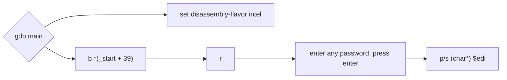

# Teknikclel69's silly crackme
### https://crackmes.one/crackme/65afe04ceef082e477ff6026
Nice and simple crackme - function `trole` is going to modify a little original password, but there is no dependencies between characters (after `trole` password, it is not changing anymore)

Password for crackme: **crackmes.one**

A few hints:
 - to resolve this crackme I have used gdb & gdbgui
 - gdbgui you can run in "remote mode" (`-r`) and debug code remotely
 - to allows gdb disable ASLR, docker container must be run with `--privileged` flag, remote debug is possible after mapping port 5000 (`-p 5000:5000`) 

password: `chicken baguette`
