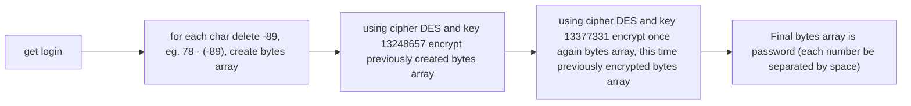

# skcrackme_1 by sknine9

### https://crackmes.one/crackme/5ab77f5333c5d40ad448c0d9

Crackme made in Java, uses DES symmetric cipher algorithm (twice, with different initial secret keys). 
Crackme might be run using: `java -cp SKCrackMe.jar eu.sknine.skcrackme1.KClass`
Steps below describe algorithm in same order as in crackme, solution uses steps in reversed order.

